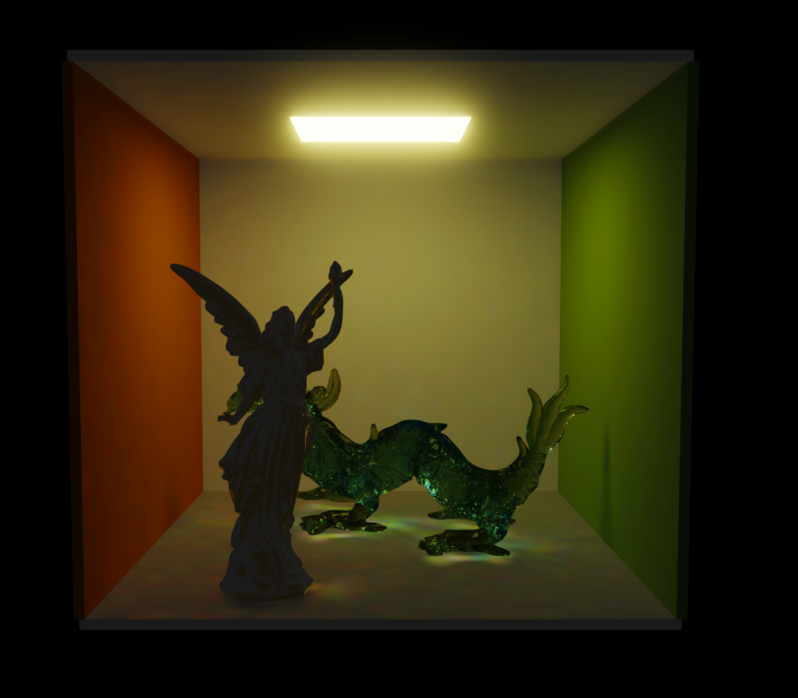
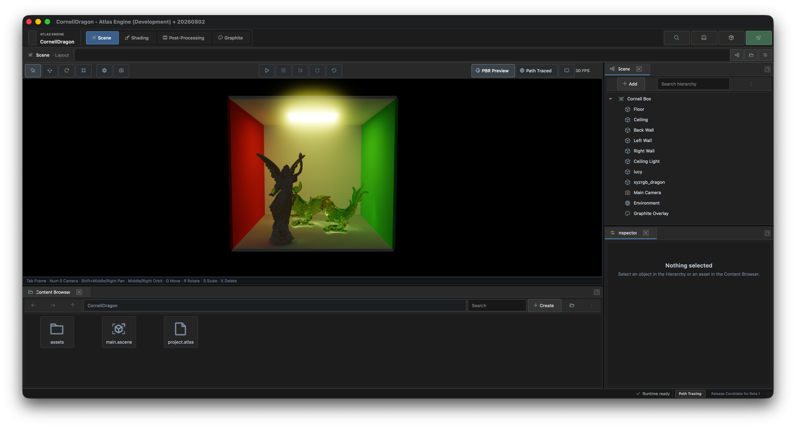

# Atlas Engine


[](https://discord.gg/WKrxKtr7kW)

Atlas is an open-source game engine built for creating real-time 3D experiences with a native editor, TypeScript scripting, and modern rendering backends. The engine is written in C++20 and brings rendering, physics, audio, terrain, environments, UI, tooling, and project packaging together in one repository.

[Website](https://atlasengine.org) · [Releases](https://github.com/neutralsoftware/atlas/releases) · [Roadmap](ROADMAP.md) · [Report an issue](https://github.com/neutralsoftware/atlas/issues) · [Discord](https://discord.gg/WKrxKtr7kW)




## Overview

Atlas provides both a visual editor and a standalone runtime. Projects are described with a `project.atlas` manifest, scenes are stored as `.ascene` files, and gameplay can be implemented with TypeScript components. The Atlas CLI handles the project lifecycle from creation through building and packaging.

The engine currently supports Metal, Vulkan, and OpenGL through the Opal rendering abstraction. macOS is the primary development platform; Windows and Linux support are part of the cross-platform design but may require additional platform-specific setup.

### Highlights

- Native editor with a hierarchy, inspector, viewport, content browser, console, and project tooling
- Forward, deferred, and path-traced rendering modes
- Metal, Vulkan, and OpenGL rendering backends
- TypeScript scripting through the Atlas runtime and QuickJS
- Scene serialization, asset management, input actions, and project packaging
- 3D physics, collision queries, joints, and vehicles through Bezel and Jolt
- Spatial audio and effects through Finewave and OpenAL Soft
- Terrain generation, atmospheric environments, weather, and fluids
- Graphite UI authoring and runtime rendering
- Global illumination, post-processing, and debugging tools

## Engine Architecture

Atlas is organized as a set of focused systems that are linked into the runtime and editor:

| System | Responsibility |
| --- | --- |
| Atlas | Scene rendering, objects, input, windows, resources, and the frame loop |
| Opal | Rendering abstraction across Metal, Vulkan, and OpenGL |
| Photon | Path tracing and global illumination |
| Bezel | Physics integration and simulation |
| Finewave | Audio playback and processing |
| Aurora | Terrain generation and rendering |
| Hydra | Atmosphere, environments, weather, and fluids |
| Graphite | Engine UI layout and rendering |
| Tracer | Logging and debugging facilities |
| Runtime | Project loading, scene execution, scripting, and the C API |
| Atlas Editor | Qt desktop editor built on the same runtime |

For a deeper source-guided explanation, start with the [architecture guide](internals/README.md).

## Get Atlas

The easiest way to use Atlas is to download a packaged build from [GitHub Releases](https://github.com/neutralsoftware/atlas/releases). Visit [atlasengine.org](https://atlasengine.org) for project news and the main Atlas entry point.

To work on the engine itself, build it from source using the instructions below.

## Build from Source

### Requirements

- Git with submodule support
- CMake 3.21 or newer
- Ninja
- Clang with C++20 support
- Python 3
- Qt 6 with the Widgets component
- Rust and Cargo for the Atlas CLI bundled with the editor
- Internet access during the first configuration so CMake can fetch dependencies

Atlas fetches SDL3, GLM, fmt, FreeType, Assimp, OpenAL Soft, and Jolt during configuration. Vulkan builds additionally require a Vulkan SDK or equivalent Vulkan loader and SPIRV-Cross development packages.

### macOS

Install the Xcode command-line tools and build dependencies:

```bash
xcode-select --install
brew install cmake ninja qt@6 python rust
```

Clone Atlas with its submodules:

```bash
git clone --recurse-submodules https://github.com/neutralsoftware/atlas.git
cd atlas
```

Configure and build the default backend. On macOS, `AUTO` selects Metal:

```bash
cmake -S . -B build -G Ninja \
  -DBACKEND=AUTO \
  -DCMAKE_PREFIX_PATH="$(brew --prefix qt@6)"
cmake --build build --parallel
```

Launch the editor:

```bash
open "build/bin/Atlas Engine.app"
```

To build only the editor and its required dependencies, use:

```bash
cmake --build build --target AtlasEditor --parallel
```

### Linux and Windows

Install the requirements above using your platform's package manager, including Qt 6 Widgets and the development packages for your selected graphics backend. Clone with `--recurse-submodules`, then configure and build with CMake:

```bash
git clone --recurse-submodules https://github.com/neutralsoftware/atlas.git
cd atlas
cmake -S . -B build -G Ninja -DBACKEND=AUTO
cmake --build build --parallel
```

`AUTO` selects Vulkan on non-Apple platforms. Pass `-DBACKEND=OPENGL` if you want an OpenGL build and have the corresponding development libraries installed.

### Select a Rendering Backend

The backend is selected at configure time:

```bash
cmake -S . -B build-metal -G Ninja -DBACKEND=METAL
cmake -S . -B build-vulkan -G Ninja -DBACKEND=VULKAN
cmake -S . -B build-opengl -G Ninja -DBACKEND=OPENGL
```

Valid values are `AUTO`, `METAL`, `VULKAN`, and `OPENGL`. Metal is available on Apple platforms.

### Build with `just`

If you have [just](https://github.com/casey/just) installed, the repository includes shortcuts for common tasks:

```bash
just config
just build
just editor
```

You can select a backend when configuring:

```bash
just config METAL
just config VULKAN
just config OPENGL
```

Build products are written to `build/bin` and libraries to `build/lib`.

## Atlas CLI Workflow

The `atlas` CLI manages the full lifecycle of an Atlas project:

```bash
atlas create myProject
cd myProject
atlas build
atlas run
atlas pack
```

The main commands are:

| Command | Purpose |
| --- | --- |
| `atlas create <name>` | Create a project and choose its platform and rendering backend |
| `atlas build` | Configure and build the current project |
| `atlas run` | Build and launch the current project |
| `atlas pack` | Create a distributable app or executable under `dist/` |
| `atlas clangd` | Generate and expose `compile_commands.json` for editor tooling |
| `atlas script init` | Initialize TypeScript support in a project |
| `atlas script compile` | Compile the project's TypeScript bundle |
| `atlas script new <name>` | Create a new script component |

Override the manifest backend for an individual command when needed:

```bash
atlas build --backend VULKAN
atlas run --backend OPENGL
atlas pack --backend METAL
atlas clangd --backend METAL
```

## Repository Guide

| Path | Contents |
| --- | --- |
| `atlas/` | Core engine implementation |
| `include/atlas/` | Public engine headers |
| `editor/` | Qt editor application |
| `runtime/` | Project runtime, scripting host, executable, and runtime API |
| `cli/` | Rust command-line tool |
| `opal/` | Rendering backend abstraction |
| `photon/` | Global illumination and path tracing |
| `bezel/` | Physics layer |
| `finewave/` | Audio layer |
| `aurora/` | Terrain system |
| `hydra/` | Environment and fluid systems |
| `graphite/` | UI system |
| `shaders/` | Backend-specific shaders |
| `tests/` | Example and test projects |
| `internals/` | Source-guided architecture documentation |

## Documentation and Community

- Visit the [Atlas website](https://atlasengine.org)
- Read the [internal architecture guide](internals/README.md)
- Follow development on the [roadmap](ROADMAP.md)
- Ask questions and share work on [Discord](https://discord.gg/WKrxKtr7kW)
- Report bugs or request features through [GitHub Issues](https://github.com/neutralsoftware/atlas/issues)

## Contributing

Contributions are welcome. Read [CONTRIBUTING.md](CONTRIBUTING.md) for branch conventions and pull-request expectations, and follow the [Code of Conduct](CODE_OF_CONDUCT.md) when participating in the community.

## License

Atlas Engine is available under the [MIT License](LICENSE.md).
