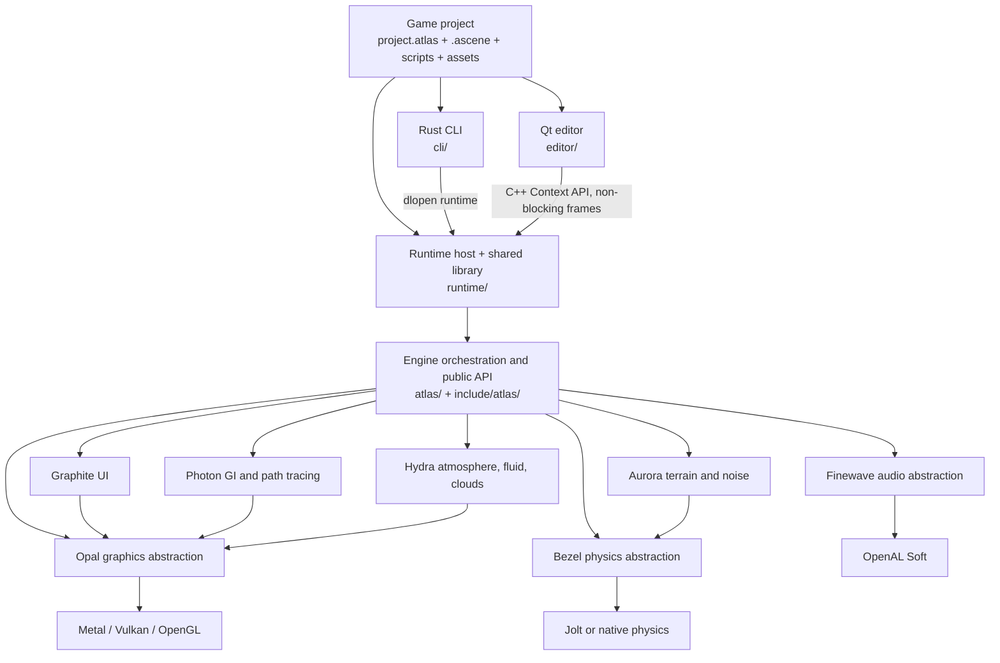
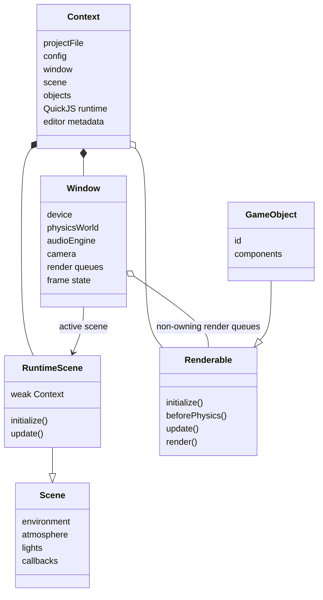

# System map

## Repository layers

The build graph makes this separation explicit: subsystem static libraries are created in `CMakeLists.txt:440-518`, combined by the `atlas` static library at `CMakeLists.txt:519-555`, and then wrapped by `runtime_lib` at `CMakeLists.txt:587-602`.

## Responsibility map

| Area | Public contract | Main implementation | Responsibility |
|---|---|---|---|
| Application/frame loop | `include/atlas/window.h:382` | `atlas/application/window.cpp:929` | Window/device creation, input polling, simulation ordering, render orchestration, presentation |
| Runtime/project state | `include/atlas/runtime/context.h:54` | `runtime/lib/context.cpp:4008` | Manifest and scene loading, owned objects, editor mutations, QuickJS lifetime |
| Scene/environment | `include/atlas/scene.h:143` | `atlas/application/scene.cpp:16` | Environment, atmosphere, skybox, ambient state, scene callbacks |
| Object model | `include/atlas/core/renderable.h:74`, `include/atlas/component.h:54`, `include/atlas/component.h:208` | `atlas/object/` | Render/update protocol, components, transforms, meshes, models, compounds |
| Graphics abstraction | `include/opal/opal.h:41` onward | `opal/` | Backend-neutral context, device, textures, pipelines, framebuffers, commands |
| Rendering features | `include/atlas/window.h:878` onward | `atlas/graphics/`, `photon/`, `hydra/` | Deferred lighting, shadows, SSAO, bloom, GI, path tracing, fluids |
| Physics | `include/atlas/physics.h:240` onward | `atlas/physics/`, `bezel/` | Engine components, backend bodies/world, queries, contacts, joints, vehicles |
| Audio | `include/finewave/audio.h:26` | `finewave/`, `include/atlas/audio.h:43` | OpenAL device/context, buffers, sources, effects, AudioPlayer component |
| Input | `include/atlas/input.h:22` onward | `atlas/application/input.cpp`, `atlas/application/window.cpp:1257` | Keys/buttons, triggers, actions, SDL events, controllers |
| Script bridge | `include/atlas/runtime/scripting.h` | `runtime/lib/scripting.cpp` | QuickJS types, native wrappers, modules, hosted script components |
| Editor | `include/editor/` | `editor/` | Project browser, Qt shell, docks, viewport, inspector, hierarchy, assets |
| Tooling | `cli/src/lib.rs:13` | `cli/src/` | Create, run, build, pack, clangd, script generation/compilation |

## Central ownership model

The architectural decision is mixed ownership by role:

- `Context` owns project-created objects with `shared_ptr`/`unique_ptr` containers (`include/atlas/runtime/context.h:63-105`).
- `Window` keeps raw, non-owning pointers in render queues for fast dispatch (`include/atlas/window.h:842-846`).
- `RuntimeScene` holds a weak reference back to `Context`, avoiding a `Context -> RuntimeScene -> Context` ownership cycle (`runtime/lib/context.cpp:4067-4068`).
- `GameObject` registers itself by numeric ID in the global `atlas::gameObjects` lookup (`include/atlas/component.h:199-220`) so physics, scripts, and editor operations can resolve identities across subsystem boundaries.

## Architectural decisions visible in the code

### One orchestration object owns the frame

`Window::stepFrame()` at `atlas/application/window.cpp:1405` is intentionally the central scheduler. Subsystems do not each own a loop; they are called in a fixed order from one place. This makes simulation/render ordering explicit.

### Backends sit below stable engine-facing types

`Rigidbody` is an Atlas component but contains/controls a Bezel body; Opal hides Metal/Vulkan/OpenGL behind common resource and command types; Finewave hides OpenAL. The build can select Metal/Vulkan/OpenGL at `CMakeLists.txt:60-87` and Jolt/native Bezel at `CMakeLists.txt:89-90,354-361` without changing game-facing APIs.

### The runtime is a shared-library product

The project executable and editor both consume `runtime_lib`, not a duplicate loader. The CLI resolves `atlas_runtime_run_project` dynamically (`cli/src/run.rs:188-220`), while the editor links the library and uses non-blocking `runtime::Context` methods directly (`editor/views/editor/viewport.cpp:572-734`). The C API also exposes non-blocking entry points for external FFI hosts (`include/atlas/runtime/c_api.h:35-91`).

### The editor yields event-loop ownership to Qt

When rendering into an external Metal view, `Window::pollEvents()` returns immediately (`atlas/application/window.cpp:1257-1260`). Qt translates input in `editor/views/editor/viewport.cpp` and calls the runtime API. This prevents SDL from consuming the desktop shell's resize, dock, or close events.
