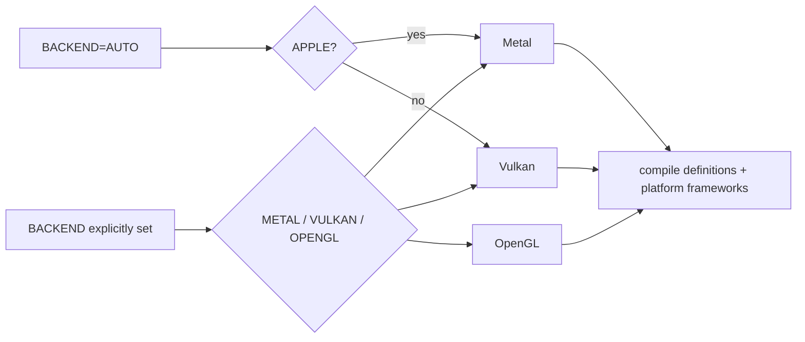
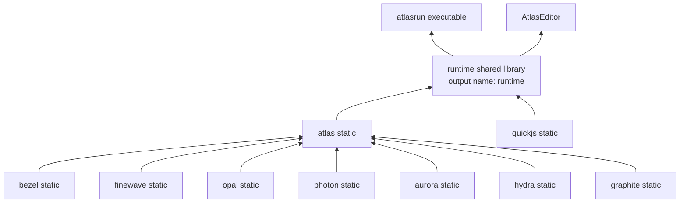

# Build graph and binaries

## Backend selection

`CMakeLists.txt:60-87` selects one renderer. `AUTO` means Metal on Apple and Vulkan elsewhere. The choice becomes a compile definition at `CMakeLists.txt:218-228`, so backend branches are compiled into Opal and Atlas rather than selected per frame.

## Generated inputs

Two source-generation steps are part of the architecture:

- Backend shaders in `shaders/<backend>/` are packed by `scripts/pack_shaders.py` into `include/atlas/core/default_shaders.h` (`CMakeLists.txt:230-279`).
- runtime JavaScript modules in `runtime/scripts/` are packed by `scripts/pack_runtime_scripts.py` into `include/atlas/runtime/atlasScripts.h` (`CMakeLists.txt:240-291`).

The generated headers let static/shared runtime products carry built-in shaders and JS API modules without relying on loose installation-time files.

## Link graph

Subsystem sources and targets are declared at `CMakeLists.txt:354-370,440-518`. Atlas links them publicly at `CMakeLists.txt:519-540`. The shared runtime links Atlas, QuickJS, and fmt at `CMakeLists.txt:587-602`; `atlasrun` is a thin executable linked to it at `CMakeLists.txt:604-615`.

## Products

| Product | Entry point | Purpose |
|---|---|---|
| `runtime` shared library | C exports in `runtime/lib/c_api.cpp:12-436` | Reusable project runtime, editor integration, dynamic loading |
| `atlasrun` | `runtime/executable/main.cpp:13` | Minimal native runner: create context, load project, run window |
| `AtlasEditor` | `editor/main.cpp:32` | Qt project browser and editor shell embedding the runtime |
| `atlas` CLI | `cli/src/main.rs:10` | Rust command dispatcher for create/build/run/pack/script/clangd |

## Why static subsystems and a shared runtime?

The CMake structure makes the lower layers implementation details of one distributable runtime: subsystem libraries are static, while `runtime_lib` is shared. The Rust CLI and other FFI hosts get a small stable C boundary (`include/atlas/runtime/c_api.h`); the C++ editor links the same library and calls `runtime::Context` directly.

## Platform boundaries

- Metal framework linking is at `CMakeLists.txt:573-581`.
- Vulkan and optional MoltenVK definitions are at `CMakeLists.txt:544-551`.
- Opal adopts an SDL window or external Metal view through `opal::Context` (`include/opal/opal.h:59-82`, `opal/device.cpp:157-172`).
- The editor has its own CMake target and copies the CLI beside the app for export; see `editor/CMakeLists.txt` and [CLI, projects, and packaging](11-cli-projects-and-packaging.md).
