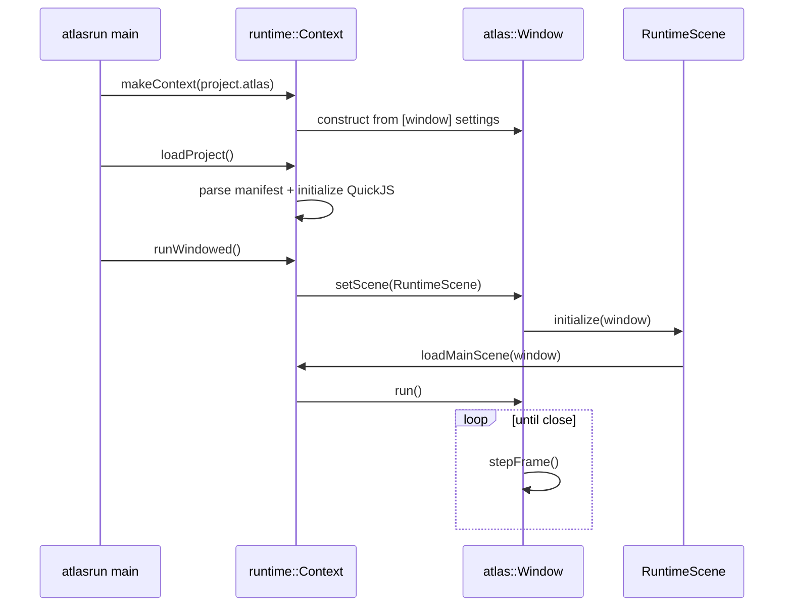
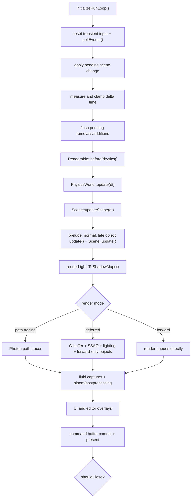

# Runtime and frame loop

## Standalone startup

The standalone runner is deliberately thin (`runtime/executable/main.cpp:13-21`):

`makeContextWithWindowOptions()` (`runtime/lib/context.cpp:4008-4070`) parses window-level settings, constructs `Window`, resolves absolute project paths, constructs `RuntimeScene`, and wires its weak context reference. Public constructors for standalone, hidden, and embedded modes are at `runtime/lib/context.cpp:4073-4118`.

`Context::loadProject()` (`runtime/lib/context.cpp:5752-5805`) parses renderer, main scene, assets, input actions, scripts, and the project root, then initializes scripting. `Context::runWindowed()` begins at `runtime/lib/context.cpp:4185`. `RuntimeScene::initialize()` (`runtime/lib/runtime.cpp:13-37`) applies renderer settings, loads input actions, initializes script classes, and loads the main scene.

## One frame

`Window::stepFrame()` spans `atlas/application/window.cpp:1405-1954` and is the best single function for understanding the engine.

### Phase references

| Phase | Source |
|---|---|
| Lazy loop initialization | `atlas/application/window.cpp:1197-1255` |
| Input reset and event polling | `atlas/application/window.cpp:1416-1422` |
| Deferred scene switch | `atlas/application/window.cpp:1423-1427,1509-1513` |
| Delta-time clamp and editor pause | `atlas/application/window.cpp:1429-1455` |
| Mutation queues | `atlas/application/window.cpp:1459-1496` |
| Component/object pre-physics and physics | `atlas/application/window.cpp:1501-1507` |
| Scene environment and object updates | `atlas/application/window.cpp:1532-1568` |
| Shadow stage | `atlas/application/window.cpp:1572-1575` |
| Target/mode selection | `atlas/application/window.cpp:1576-1644` |
| Deferred path plus forward-only tail | `atlas/application/window.cpp:1646-1742` |
| Forward path | `atlas/application/window.cpp:1744-1777` |
| Runtime loop wrapper | `atlas/application/window.cpp:3427-3431` |

## Why object additions/removals are queued

`Window::addObject()` and `addInitializedObject()` (`atlas/application/window.cpp:3433-3492`) queue objects once the physics world is active. `stepFrame()` flushes those queues before physics. `removeObjectInternal()` (`atlas/application/window.cpp:3500-3572`) similarly defers removal. This avoids invalidating render/update containers during callbacks and keeps physics synchronization at a frame boundary.

## Scene switching

`Window::setScene()` (`atlas/application/window.cpp:3741-3754`) defers a switch while the physics world exists. `applyScene()` (`atlas/application/window.cpp:3671-3739`) resets physics identifiers/world state, render queues, targets, cached shadows/SSAO, frame timing, and editor selection before initializing the replacement scene.

## Editor pause semantics

The same frame loop supports editing and play mode. At `atlas/application/window.cpp:1445-1455`, simulation runs when editor controls are off or editor simulation is enabled. When paused, game delta time becomes zero, but the editor camera still advances with a fallback 1/60-second delta. Environment updates are throttled rather than completely disabled at `atlas/application/window.cpp:1532-1545`.

## Shutdown

`Window::run()` calls `endRunLoop()` after `stepFrame()` returns false (`atlas/application/window.cpp:3427-3431`). `Context::end()` begins at `runtime/lib/context.cpp:5715`; `Context::~Context()` at `runtime/lib/context.cpp:5723` releases script/scene/runtime state. `Window::~Window()` (`atlas/application/window.cpp:3859`) shuts down audio and graphics/window resources.
