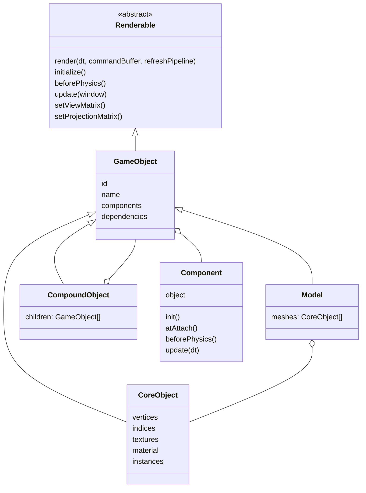
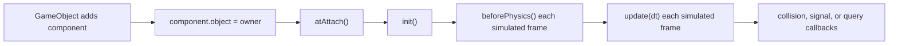

# Scene, objects, and components

## Type hierarchy

## Renderable: the frame-loop contract

`Renderable` is declared at `include/atlas/core/renderable.h:74-190`. Only `render()` is mandatory. Optional hooks cover initialization, update, pre-physics work, camera matrices, pipeline access, shadow eligibility, and deferred eligibility.

Three flags route objects without changing their type:

- `renderDepthOfView` at `include/atlas/core/renderable.h:177` participates in depth-of-field work.
- `renderLateForward` at `include/atlas/core/renderable.h:184` moves an object behind the normal forward queue.
- `editorOnly` at `include/atlas/core/renderable.h:190` hides helpers outside editor mode.

## GameObject: identity plus components

`GameObject` begins at `include/atlas/component.h:208`. Constructors assign a random integer ID and register `this` in `atlas::gameObjects` (`include/atlas/component.h:199-268`). That ID is the shared language used by scene JSON, the editor, scripting wrappers, physics callbacks, and C API calls.

The component base class is at `include/atlas/component.h:54-140`. Its lifecycle is:

`TraitComponent<T>` (`include/atlas/component.h:149-197`) is the typed variant: it forwards updates to `updateComponent(T*)` only for a compatible object type.

## CoreObject: the normal drawable mesh

`CoreObject` is declared at `include/atlas/object.h:305` and implemented in `atlas/object/core_object.cpp`.

| Function | Role |
|---|---|
| `CoreObject::initialize()` — `atlas/object/core_object.cpp:384` | Build buffers/drawing state and prepare pipeline/resources |
| `CoreObject::render()` — `atlas/object/core_object.cpp:520` | Bind shader/pipeline/state, upload transforms/material/lights, issue draws |
| `CoreObject::update()` — `atlas/object/core_object.cpp:1013` | Per-frame object/component update path |
| `CoreObject::updateModelMatrix()` — `atlas/object/core_object.cpp:373` | Rebuild transform matrix from position/rotation/scale |
| `CoreObject::updateVertices()` — `atlas/object/core_object.cpp:1002` | Refresh GPU vertex data after CPU geometry changes |
| `CoreObject::updateInstances()` — `atlas/object/core_object.cpp:1066` | Rebuild instance transforms/buffer data |

Geometry enters through `attachVertices()` and `attachIndices()` (`atlas/object/core_object.cpp:237-247`). Textures and material data are attached before `initialize()` when possible.

## Model: imported mesh collection

`Model::loadModel()` (`atlas/object/model.cpp:149-207`) uses Assimp, applies triangulation/tangent/normal-related import flags, and recursively traverses the imported node tree. `processNode()` (`atlas/object/model.cpp:209-225`) creates a `CoreObject` per mesh. `processMesh()` (`atlas/object/model.cpp:227-447`) transforms vertices, normals, tangents, UVs, and colors, imports material properties/textures, and attaches geometry. `loadMaterialTextures()` (`atlas/object/model.cpp:449-507`) uses a per-model cache and registers file resources in `Workspace`.

## CompoundObject: composition

`CompoundObject::addObject()` starts at `atlas/object/compound.cpp:68`; `initialize()` at line 120 initializes children; `render()` at line 138 traverses the normal child path; `update()` at line 246 forwards logic. It is a structural object that lets multiple `GameObject`s behave as one renderable while retaining child-specific types.

## Scene: environment and callbacks, not object ownership

`Scene` begins at `include/atlas/scene.h:143`. It stores environment, skybox, atmosphere, lights, and callback hooks. The project runtime's object ownership remains in `Context`, while `Window` owns the active render queues.

`Scene::updateScene()` (`atlas/application/scene.cpp:16`) updates dynamic atmosphere, derives skybox/ambient values, and maintains environmental render state. The virtual `initialize`, `update`, `onMouseMove`, and `onMouseScroll` hooks are specialized by `RuntimeScene`.

## Project scene loading

`Context::loadMainScene()` (`runtime/lib/context.cpp:5876-5889`) resolves the configured `.ascene`, loads JSON, stores the scene path/name, and calls `loadScene()`. `Context::loadScene()` begins at `runtime/lib/context.cpp:5891`; it resets prior environment/lights/objects, parses scene sections, creates engine objects/components, registers names/references, resolves parents, attaches scripts, and adds renderables to `Window`.

The editor keeps original JSON fragments in the `editor*Data` maps declared at `include/atlas/runtime/context.h:92-105`. This is why editor mutations can preserve fields not directly represented by a simple C++ property.
