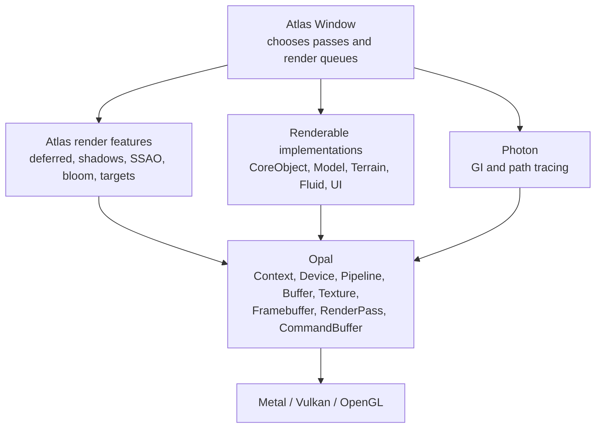
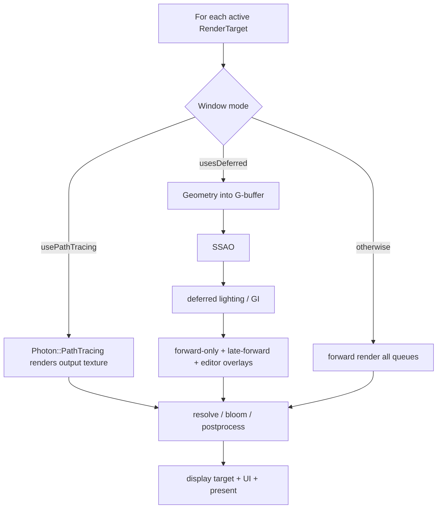

# Rendering architecture

## Layers

Atlas decides *what* and *when* to render. Opal decides *how* a pipeline, texture, framebuffer, or command maps to the selected API.

## Opal's resource/command model

The public abstraction is concentrated in `include/opal/opal.h`:

| Type | Declaration | Key implementation |
|---|---|---|
| `Context` | `include/opal/opal.h:59` | window/backend context creation in `opal/device.cpp:157-296` |
| `Device` | `include/opal/opal.h:172` | command/default framebuffer/resource access in `opal/device.cpp` |
| `Texture` | `include/opal/opal.h:304` | allocation/upload/readback/sampling in `opal/texture.cpp` |
| `Shader` / `ShaderProgram` | `include/opal/opal.h:460,497` | compilation/reflection/linking in `opal/shaders.cpp` |
| `Pipeline` | `include/opal/opal.h:614` | state collection and backend pipeline construction in `opal/pipeline.cpp:353-1708` |
| `Buffer` / `DrawingState` | `include/opal/opal.h:876,913` | GPU buffers and vertex/index binding in `opal/buffer.cpp` |
| `Framebuffer` / `RenderPass` | `include/opal/opal.h:958,1073` | attachment/pass setup in `opal/framebuffer.cpp:107-802` |
| `CommandBuffer` | `include/opal/opal.h:1185` | pass lifetime, draws, compute, resolve, commit in `opal/command_buffer.cpp:1125-2277` |

Typical command ordering is `start()` (`opal/command_buffer.cpp:1146`), `beginPass()` (`opal/command_buffer.cpp:1188`), bind pipeline/drawing state, draw/dispatch, `endPass()` (`opal/command_buffer.cpp:1345`), and `commit()` (`opal/command_buffer.cpp:1391`).

## Render queues

`Window` maintains separate non-owning queues. Their insertion functions show their intent:

- normal renderables: `Window::addObject()` at `atlas/application/window.cpp:3433`;
- prelude renderables: `addPreludeObject()` at `atlas/application/window.cpp:3623`;
- late-forward renderables: `addLateForwardObject()` at `atlas/application/window.cpp:3574`;
- preference/postprocess renderables: `addPreferencedObject()` at `atlas/application/window.cpp:3605`;
- UI renderables: `addUIObject()` at `atlas/application/window.cpp:3645`.

The queues make ordering a property of registration rather than a giant type switch.

## Render modes

Mode selection occurs at `atlas/application/window.cpp:1576-1644`. The deferred branch begins at `atlas/application/window.cpp:1646`; the forward branch begins at `atlas/application/window.cpp:1744`. `Window::useDeferredRendering()` is at `atlas/application/window.cpp:4689`, `enableGlobalIllumination()` at `atlas/graphics/deferred.cpp:255`, and `enablePathTracing()` at `atlas/application/window.cpp:5447`.

## Deferred renderer

`Window::deferredRendering()` begins at `atlas/graphics/deferred.cpp:263`. It fills the G-buffer from compatible objects, runs SSAO (`atlas/graphics/ssao.cpp:79`), binds fallback textures when optional inputs are absent, accumulates lighting, and leaves non-deferred/transparent objects for the forward tail in `stepFrame()`.

The architecture uses capability routing: `Renderable::canUseDeferredRendering()` (`include/atlas/core/renderable.h:169`) decides whether an object enters the G-buffer path, instead of assuming every drawable can be deferred.

## Shadows and lights

`Window::renderLightsToShadowMaps()` begins at `atlas/application/window.cpp:4020`. Individual light shadow setup lives in `atlas/graphics/light.cpp`: point lights `Light::castShadows()` at line 368, spot lights at line 199, directional lights at line 209, and area lights at line 406. Shadow dirtiness/signatures in `Window` avoid rebuilding every map without a state change.

## Render targets and postprocessing

`RenderTarget` is the scene/offscreen boundary. Important operations are `display()` (`atlas/graphics/render_target.cpp:469`), `resolve()` (`atlas/graphics/render_target.cpp:522`), `bind()` (`atlas/graphics/render_target.cpp:557`), and visibility controls (`atlas/graphics/render_target.cpp:642-650`).

SSAO setup/render lives at `atlas/graphics/ssao.cpp:21,79`. Bloom target creation/destruction is at `atlas/graphics/bloom.cpp:21,144`, and the window's physical bloom pass starts at `atlas/application/window.cpp:4705`.

## Specialized rendering

- Photon GI: `photon::GlobalIllumination::init()` at `photon/gi.cpp:226`; probe layout at `photon/gi.cpp:267`.
- Photon path tracing: initialization at `photon/path_tracing.cpp:154`, resize at `photon/path_tracing.cpp:186`, light buffers at `photon/path_tracing.cpp:489`.
- Hydra fluids: create/init/update at `hydra/fluid.cpp:35,42,225`; reflection/refraction target maintenance at `hydra/fluid.cpp:318`; window capture orchestration at `atlas/application/window.cpp:4754`.
- Particles: initialize/spawn/update at `atlas/graphics/particle.cpp:42,127,288`.
- Model import: `atlas/object/model.cpp:149-507`.

## Pipeline refresh decision

`Window::markPipelineStateDirty()` and `shouldRefreshPipeline()` are at `atlas/application/window.cpp:5044-5064`. Renderables receive the result as the `updatePipeline` argument. This centralizes changes to window-wide depth/blend/cull/viewport state while allowing objects to cache their pipeline between compatible draws.
