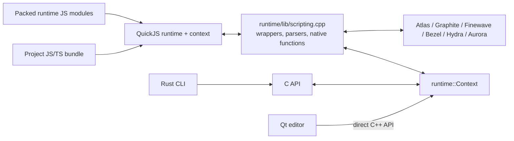
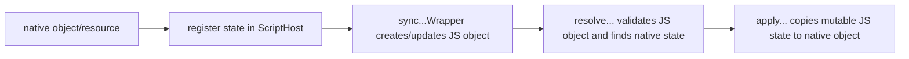

# Scripting and runtime API

## Boundary overview

There are two foreign-language boundaries, both owned by `runtime/lib/`:

1. QuickJS exposes engine concepts to project scripts.
2. The C API exposes project/runtime/editor operations to Rust and other FFI consumers without exporting C++ ABI details. The Qt editor is built in C++ and currently calls `runtime::Context` directly.

## QuickJS lifetime

`Context` owns `JSRuntime`, `JSContext`, `ScriptHost`, module registries, and project object state (`include/atlas/runtime/context.h:54-109`). `Context::initializeScripting()` (`runtime/lib/context.cpp:4120-4151`) creates QuickJS objects, stores `ScriptHost` as the opaque pointer, installs native globals, installs the module loader, clears old scene bindings, registers built-in modules, and optionally loads the project bundle.

`runtime::scripting::installGlobals()` begins at `runtime/lib/scripting.cpp:15628`. It is the large native registration table connecting internal `__atlas...`, `__finewave...`, and related functions to C++ shims. The packed, friendly JavaScript classes call those internal functions; their source originates in `runtime/scripts/` and is generated into `include/atlas/runtime/atlasScripts.h` by `CMakeLists.txt:281-291`.

## Binding pattern

Most native types use the same four-stage pattern:

Representative locations in `runtime/lib/scripting.cpp`:

- state lookup/registration: audio at `1368-2244`, graphics resources at `2245-2662`, environment/UI/physics thereafter;
- wrapper synchronization: `syncWindowWrapper()` at `3538`, `syncSceneWrapper()` at `3576`, `syncCameraWrapper()` at `3793`, and object wrappers at `3945-4517`;
- apply functions: object/terrain/light/UI/physics families at `4518-6952`;
- resolver functions: `6953-7604` and later type-specific helpers;
- native function implementations: roughly `7605-14970`;
- native global registration: `15628-16682`.

This file is intentionally broad because it is the type-conversion boundary for nearly every engine subsystem.

## Script modules and instances

`Context::registerScriptModule()` (`runtime/lib/context.cpp:4170-4183`) converts an absolute script path into a normalized project module name and loads the source once. Module normalization/loading is implemented at `runtime/lib/scripting.cpp:16732-16776`.

Hosted script components are created through `runtime::scripting::createScriptInstance()` at `runtime/lib/scripting.cpp:16813`; `ScriptInstance::callMethod()` at `runtime/lib/scripting.cpp:16808` is the method dispatch point. Interactive frame/mouse dispatch is at `runtime/lib/scripting.cpp:15417-15504`, called by `RuntimeScene::update/onMouseMove/onMouseScroll` at `runtime/lib/context.cpp:5807-5874`.

## C API

The stable FFI declarations are in `include/atlas/runtime/c_api.h:12-91`; implementations are in `runtime/lib/c_api.cpp`. The editor-facing operations are available here for external hosts, although the in-tree Qt editor uses the equivalent `Context` methods directly.

| API group | Contract | Purpose |
|---|---|---|
| Blocking run | `include/atlas/runtime/c_api.h:12-28` | Run a project normally or inside a host Metal view |
| Non-blocking embedded runtime | `include/atlas/runtime/c_api.h:35-47` | Create a context, step frames, resize it |
| Editor controls/input | `include/atlas/runtime/c_api.h:49-60` | Pause simulation, set gizmo mode, route pointer/scroll/key input |
| Scene inspection/mutation | `include/atlas/runtime/c_api.h:61-80` | Snapshot, select, rename, set properties/components/parents, create/delete/save |
| Lifetime | `include/atlas/runtime/c_api.h:85-91` | End frame-loop resources and destroy the opaque context |

The opaque handle is a heap-owned `std::shared_ptr<Context>` wrapper inside the C implementation. This lets the C surface remain pointer-sized while C++ retains its ownership model.

## Editor mutation model

Editor operations call `Context` methods declared at `include/atlas/runtime/context.h:119-155`. The main implementation region is `runtime/lib/context.cpp:4279-5715`. `sceneObjectsJson()` serializes a snapshot; mutation functions update native objects plus editor JSON metadata; `saveCurrentScene()` writes the reconstructed `.ascene`.

Property synchronization is handled separately (`Context::setPropertySync()` at `runtime/lib/context.cpp:4963` and `applyPropertySyncs()` at `runtime/lib/context.cpp:4613`) because it represents a relationship between endpoints, not just one object's local value.

## Failure/ownership rule

The C boundary catches C++ exceptions and reports failure rather than allowing exceptions to cross into Rust or another FFI host. The caller must pair create/end/destroy correctly. Script values are similarly duplicated/freed through QuickJS APIs; `clearSceneBindings()` (`runtime/lib/scripting.cpp:15003`) is the central scene-reset cleanup path.
