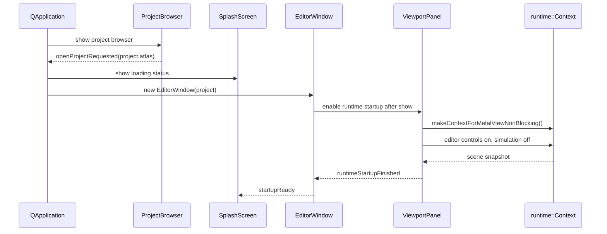
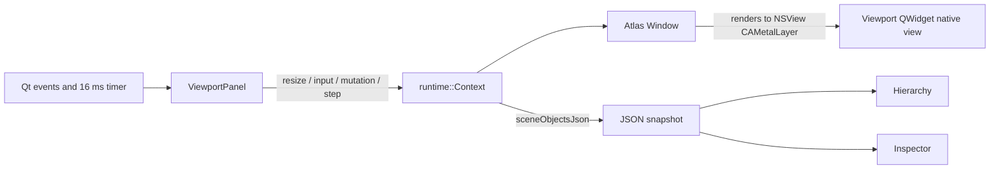
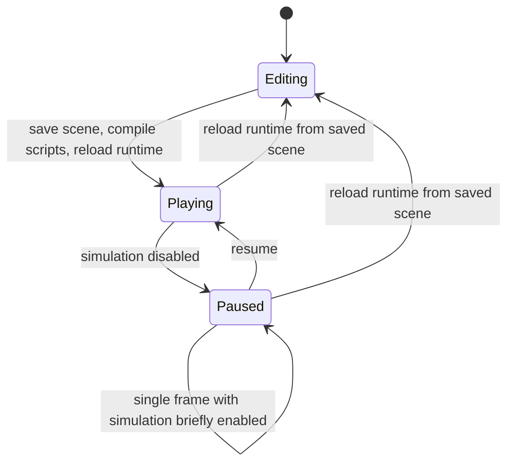

# Editor architecture

## Desktop startup

`editor/main.cpp:32-110` configures QApplication, fonts/theme/toolchain, shows the splash and project browser, and creates `EditorWindow` after a project is selected.

## EditorWindow: shell and coordination

`EditorWindow` is the main Qt coordinator, implemented in `editor/views/editor/editor.cpp`.

| Function | Responsibility |
|---|---|
| `setupWindow()` — `editor/views/editor/editor.cpp:242` | Main window properties, timers, project identity |
| `setupMenus()` — `editor/views/editor/editor.cpp:286` | Actions and portable shortcuts |
| `setupDocks()` — `editor/views/editor/editor.cpp:586` | Creates viewport, hierarchy, inspector, content, material, postprocess panels |
| `setupWorkspaceBar()` — `editor/views/editor/editor.cpp:739` | Workspace/page switching and viewport toolbar |
| `showProjectSettings()` — `editor/views/editor/editor.cpp:923` | Manifest-backed settings UI |
| `showExportDialog()` — `editor/views/editor/editor.cpp:1127` | Starts CLI packaging with visible progress/logging |
| `showCommandPalette()` / `showGlobalSearch()` — `editor/views/editor/editor.cpp:1334,1433` | Cross-editor command and content access |
| `runProjectCommand()` — `editor/views/editor/editor.cpp:1590` | Runs CLI build/run operations |
| `saveLayout()` / `restoreLayout()` — `editor/views/editor/editor.cpp:1714,1724` | QSettings persistence for geometry/docks |
| `closeEvent()` — `editor/views/editor/editor.cpp:1795` | Saves layout and shuts down embedded runtimes safely |

## Docking

`EditorDockManager::addPanel()` (`editor/core/dockManager.cpp:34`) translates Atlas dock descriptors into Qt Advanced Docking System widgets. The center panel is installed as the true central widget in this function, while other areas are attached around it. `EditorWindow::setupDocks()` registers the viewport first as the center, then the surrounding tool panels.

Dock state is versioned and persisted at `editor/views/editor/editor.cpp:1714-1740`, so structural layout changes can invalidate incompatible stored state.

## Embedded runtime

`ViewportPanel` is the editor/engine seam. `startRuntime()` (`editor/views/editor/viewport.cpp:572-648`) takes the QWidget native `winId()` as a Metal view, creates a non-blocking `Context`, enables editor controls, disables simulation, resizes, and obtains the first scene snapshot. A 16 ms Qt timer calls `stepRuntime()` (`editor/views/editor/viewport.cpp:678-698`), which calls `Context::stepFrame()` and refreshes the snapshot.

The ownership decision is essential: Qt owns app-level events. `Window::pollEvents()` exits for an external Metal view (`atlas/application/window.cpp:1257-1260`), and `ViewportPanel` forwards only viewport-specific input. Resize forwarding is at `editor/views/editor/viewport.cpp:700-723`; pointer forwarding and Y-axis conversion are at `editor/views/editor/viewport.cpp:725-734`.

## Scene snapshot as editor read model

The runtime remains authoritative. `ViewportPanel::refreshSceneSnapshot()` begins at `editor/views/editor/viewport.cpp:1444`; it asks `Context` to serialize current editor-visible state. `HierarchyPanel::applySceneSnapshot()` (`editor/views/editor/hierarchy.cpp:267`) rebuilds/updates the object tree. `InspectorPanel::applySceneSnapshot()` (`editor/views/editor/inspector.cpp:1235`) updates property editors.

Mutations flow in the other direction through `ViewportPanel` methods such as select/rename/property/component/parent/create/delete (`editor/views/editor/viewport.cpp:736-1163`), then the snapshot is refreshed. This command-plus-snapshot design prevents Qt widgets from directly owning engine objects.

## Play, pause, step, stop

The implementation is `ViewportPanel::playRuntime()` through `reloadRuntime()` at `editor/views/editor/viewport.cpp:1209-1290`. Play checkpoints the scene, runs `atlas script compile`, reloads, then enables simulation. Stop reloads the saved scene rather than trying to reverse arbitrary runtime mutations.

## Undo/redo

The viewport owns a Qt undo stack and records editor commands around runtime mutations (`editor/views/editor/viewport.cpp:1164-1187` and mutation helpers). Undo/redo therefore replay runtime commands, then refresh the snapshot; they do not rewind the engine frame state.

## Project browser and creation

`ProjectBrowser` UI/filter/open/create behavior is at `editor/views/general/projectBrowser.cpp:308-537`. `ProjectStore` persists recent projects and creates templates (`editor/project/projectStore.cpp:148-327`). Project creation writes `project.atlas` and `main.ascene`, initializes `assets/scripts`, then calls `atlas script init` (`editor/project/projectStore.cpp:211-285`).

## Editor packaging decisions

`editor/CMakeLists.txt:19-52` builds the Rust CLI as an editor dependency. On macOS it copies the CLI into `Contents/Helpers` and `runtime.dylib` into `Contents/Frameworks` (`editor/CMakeLists.txt:97-124`). This keeps export and run commands fast and deterministic from the app instead of invoking `cargo run` interactively.
