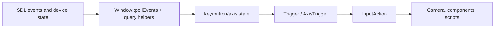
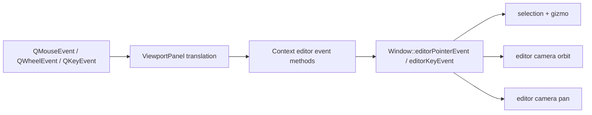

# Input and camera

## Runtime input pipeline

Input value types are in `include/atlas/input.h`:

- `Key` and `MouseButton` enumerate raw inputs (`include/atlas/input.h:22,149`).
- `Trigger` represents a key, mouse button, or controller button (`include/atlas/input.h:244-272`).
- `AxisTrigger` represents a mouse axis, key-composed axis, or controller axis (`include/atlas/input.h:274-312`).
- `InputAction` groups triggers under a named action (`include/atlas/input.h:384`).
- `Interactive` is the callback-oriented interface (`include/atlas/input.h:457`).

SDL events are consumed in `Window::pollEvents()` (`atlas/application/window.cpp:1257-1403`). Per-frame pressed arrays and text input are cleared before polling at `atlas/application/window.cpp:1416-1422`, distinguishing “pressed this frame” from “currently active.” Named action evaluation is at `atlas/application/window.cpp:5104-5320`.

Controller/joystick trigger factories and rumble are implemented in `atlas/application/input.cpp:15-161`. Device discovery and SDL handle management are in `atlas/application/window.cpp:523-894,5334-5445`.

## Project input actions

`Context::loadProject()` reads the input-actions path from `[game]` (`runtime/lib/context.cpp:5771-5774`). Parsing functions are `parseTrigger()` (`runtime/lib/context.cpp:3362`), `parseAxisTrigger()` (`runtime/lib/context.cpp:3412`), and `parseInputAction()` (`runtime/lib/context.cpp:3516`). The resulting actions are installed during `RuntimeScene::initialize()` in `runtime/lib/runtime.cpp:13-37`.

## Runtime camera

`Camera` is declared at `include/atlas/camera.h:41`. Its central functions are:

| Function | Source | Role |
|---|---|---|
| `calculateViewMatrix()` | `atlas/camera.cpp:54` | Builds the view matrix from camera pose/target |
| `move`, `setPosition`, `lookAt` | `atlas/camera.cpp:66-100` | Direct transform control |
| `moveTo()` | `atlas/camera.cpp:101` | Direction-relative movement |
| `update()` | `atlas/camera.cpp:133` | Default action/keyboard/controller camera movement |
| `updateLook()` | `atlas/camera.cpp:268` | Mouse-look rotation |
| `updateZoom()` | `atlas/camera.cpp:290` | Scroll zoom |

`RuntimeScene::update()` (`runtime/lib/context.cpp:5807-5833`) either updates the automatic camera and dispatches the script frame, or only dispatches scripts. Mouse move/scroll callbacks at `runtime/lib/context.cpp:5835-5874` route to scripts and optionally to automatic camera control.

## Editor input pipeline

Embedded editor input bypasses SDL polling:

Qt mouse buttons are mapped in `editor/views/editor/viewport.cpp:62-91`. Press/move/release handlers are at `editor/views/editor/viewport.cpp:398,434,465`; wheel/key handlers begin at `editor/views/editor/viewport.cpp:487,499,554`. `sendPointerEvent()` flips Qt's top-left Y coordinate to the runtime coordinate convention (`editor/views/editor/viewport.cpp:725-734`).

Runtime routing is in `Window::editorPointerEvent()` near `atlas/application/window.cpp:2200-2323`. Selection begins at `atlas/application/window.cpp:2351`, gizmo hit testing at `atlas/application/window.cpp:2408`, transform drag at `atlas/application/window.cpp:2565`, orbit at `atlas/application/window.cpp:2839`, and pan at `atlas/application/window.cpp:2857`. The current gesture contract is right-drag pan and middle-drag orbit; keyboard camera motion/inertia are at `atlas/application/window.cpp:2965,3016`.

## Why separate runtime and editor cameras?

Game camera behavior can be scripted or action-driven. Editor navigation must remain responsive while simulation is paused. `Window::stepFrame()` therefore updates editor camera movement with an editor delta (`atlas/application/window.cpp:1445-1455`) while setting game delta time to zero.
