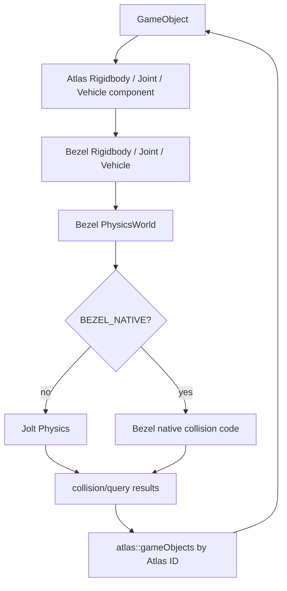

# Physics architecture

## Layer boundary

Atlas physics types are components and use engine units/objects (`include/atlas/physics.h:240-523`). Bezel owns backend-specific world/body/query implementation (`include/bezel/bezel.h:56-648`). The split lets scene/scripts interact with Atlas types while the CMake `BEZEL_NATIVE` option selects Jolt or native sources (`CMakeLists.txt:89-90,354-361`).

## Frame ordering

The physics step is explicit in `Window::stepFrame()`:

1. Every renderable receives `beforePhysics()` (`atlas/application/window.cpp:1501-1504`).
2. `PhysicsWorld::update(deltaTime)` advances the world (`atlas/application/window.cpp:1506`).
3. Normal object/component `update()` runs after physics (`atlas/application/window.cpp:1547-1568`).

This ordering lets `Rigidbody::beforePhysics()` push object-authored changes into the backend, while `Rigidbody::update()` can pull simulated transforms back onto the object. Those functions are at `atlas/physics/rigidbody.cpp:202,218`.

## World and bodies

`Window::initializeRunLoop()` constructs/initializes the physics world at `atlas/application/window.cpp:1205-1206`. Scene replacement recreates it and gravity at `atlas/application/window.cpp:3686-3690`.

Jolt world initialization and stepping are `bezel::PhysicsWorld::init()` and `update()` at `bezel/jolt/world.cpp:186,227`. Atlas-side body attachment/creation is `Rigidbody::atAttach()` and `init()` at `atlas/physics/rigidbody.cpp:91,110`. Collider creation is at `atlas/physics/rigidbody.cpp:143-200`; force/velocity/property operations occupy `atlas/physics/rigidbody.cpp:250-374`.

## Collision events

The Jolt contact listener queues contact changes and dispatches them at a safe point (`bezel/jolt/query/rigidbody_query.cpp:136`). `JoltCollisionDispatcher::setup/update()` at `bezel/jolt/query/rigidbody_query.cpp:367-375` installs the listener and flushes events. Backend body IDs resolve to Bezel rigidbodies, whose Atlas IDs resolve through `atlas::gameObjects`; then both `GameObject`s receive collision callbacks (`bezel/jolt/query/rigidbody_query.cpp:260-365`).

The ID bridge is why `BodyIdentifier` carries both backend and Atlas identity (`include/bezel/bezel.h:56-64`).

## Queries

Atlas exposes raycast, overlap, and sweep-style prediction on `Rigidbody` (`include/atlas/physics.h:435-475`). Atlas implementations translate Bezel results into engine-facing `QueryResult` variants:

- raycast and raycast-all: `atlas/physics/rigidbody.cpp:403,447`;
- overlap shapes/current collider/world queries: `atlas/physics/rigidbody.cpp:700-836`;
- movement prediction/sweeps: `atlas/physics/rigidbody.cpp:837-1071`.

Bezel's Jolt query implementations begin at `bezel/jolt/query/rigidbody_query.cpp:377` and continue through the file. Script conversions and dispatch live in `runtime/lib/scripting.cpp:6130-6333`.

## Joints and vehicles

Atlas joint components create/update backend constraints during `beforePhysics()`:

- fixed: `atlas/physics/atlas_joints.cpp:19-76`;
- hinge: `atlas/physics/atlas_joints.cpp:77-145`;
- spring: `atlas/physics/atlas_joints.cpp:146-214`.

Backend Jolt constraint creation is at `bezel/jolt/joints.cpp:19,141,348`. Vehicle attachment/recreation lives in `atlas/physics/vehicle.cpp:14-52`; Jolt vehicle creation/destruction is at `bezel/jolt/vehicle.cpp:88,248`.

## Architectural cautions

- `Window` owns the active `PhysicsWorld`; components must obtain the current world rather than retain a stale one across scene reloads.
- Object mutation is frame-queued once physics exists, which keeps backend creation/removal out of arbitrary callbacks.
- Collision callbacks resolve raw identities. Object destruction must remove registry entries and backend maps so IDs cannot point at retired objects.
