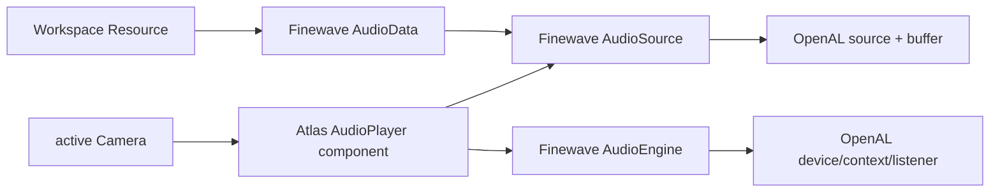
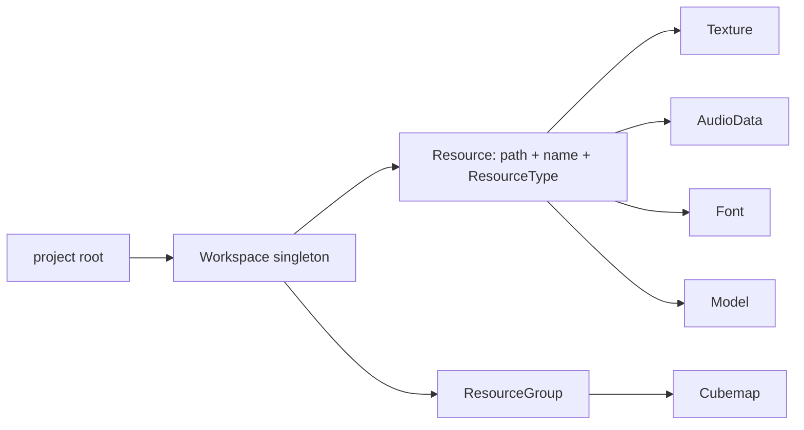

# Audio and resources

## Finewave audio stack

`Window` constructs and initializes its `AudioEngine` in `atlas/application/window.cpp:1096-1101` and shuts it down in `Window::~Window()` at `atlas/application/window.cpp:3859-3862`.

`AudioEngine::initialize()` (`finewave/engine.cpp:46-123`) opens the default OpenAL device, creates/makes current the context, initializes listener state, and selects the inverse-distance-clamped model. Shutdown is at `finewave/engine.cpp:125-142`; listener setters are at `finewave/engine.cpp:144-165`.

Audio data decoding/loading is `AudioData::fromResource()` at `finewave/load.cpp:74`. `AudioSource` buffer/playback/spatial controls are implemented in `finewave/source.cpp:79-316`. Reverb, echo, and distortion use the OpenAL EFX path in `finewave/effect.cpp:34-112`.

## AudioPlayer component

`AudioPlayer` is an Atlas `Component` declared inline at `include/atlas/audio.h:43`. It owns one `AudioSource`, forwards play/pause/stop/loop/volume/source calls, and in `update()` (`include/atlas/audio.h:152-167`) synchronizes the global listener from the main camera plus the source position from its owning object.

The decision to put listener synchronization here means spatial audio updates when an audio player component updates. Script access also exists through the Finewave bridge in `runtime/lib/scripting.cpp` (engine/source state and wrappers around `1368-2244`, native calls around `9644-10500`).

## Workspace resources

`Resource` is a typed path/name value; `ResourceGroup` is a named collection; `Workspace` is the process-wide registry (`include/atlas/workspace.h:24-165`).

`Context::loadProject()` sets the workspace root to the project directory at `runtime/lib/context.cpp:5803`. `Workspace::createResource()` (`atlas/application/workspace.cpp:13`) resolves relative paths against that root and deduplicates by name. Group creation and lookup are at `atlas/application/workspace.cpp:35-89`.

## Asset consumers

| Resource consumer | Entry point |
|---|---|
| Texture | `Texture::fromResource` in `atlas/graphics/texture_create.cpp` |
| Cubemap | `Cubemap::fromResourceGroup()` at `atlas/graphics/texture.cpp:440` |
| Model | `Model::loadModel()` at `atlas/object/model.cpp:149` |
| Audio | `AudioData::fromResource()` at `finewave/load.cpp:74` |
| Font/UI | Graphite font/text paths in `graphite/text.cpp` and scripting wrappers |

The runtime scene loader creates resources while interpreting scene/material definitions. The editor content browser operates on project files (`editor/views/general/contentBrowser.cpp`) and asks the runtime to attach/import them; it does not replace `Workspace` as the runtime registry.

## Resource ownership distinction

`Workspace` stores lightweight descriptors, not all decoded GPU/audio/model payloads. Textures, buffers, audio data, and model objects own backend resources separately. This keeps path discovery/deduplication independent from resource lifetime and upload strategy.
