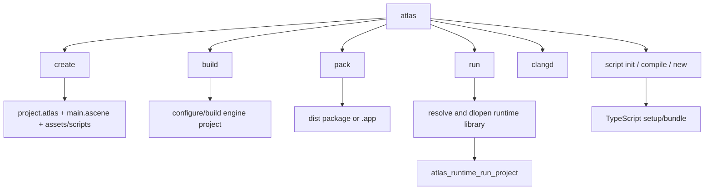
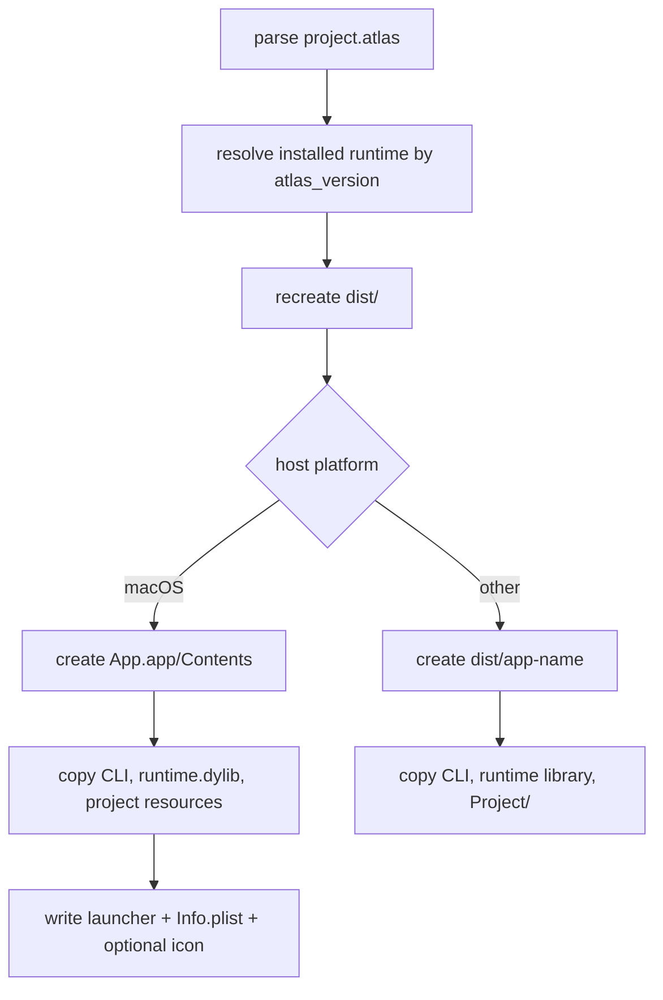

# CLI, project files, and packaging

## CLI command map

`cli/src/main.rs:10-30` dispatches the command enum declared at `cli/src/lib.rs:13-65`.

## Project manifest

`project.atlas` is TOML. A representative file is `tests/simple/project.atlas`.

| Section/key | Read by | Meaning |
|---|---|---|
| root `name`, `app_name`, `atlas_version`, `backend`, `platform` | CLI `cli/src/lib.rs:67-89`, pack/run code | project identity, runtime/toolchain selection, build target |
| `[game].main_scene` | `Context::loadProject()` at `runtime/lib/context.cpp:5771-5774` | first `.ascene` loaded |
| `[game].assets` | `runtime/lib/context.cpp:5776-5784` | asset directory configuration |
| `[game].input_actions` | `runtime/lib/context.cpp:5773-5774` | input-action definition file |
| `[renderer]` | `runtime/lib/context.cpp:5765-5769`, `RuntimeScene::initialize()` | normal/deferred/path tracing, GI, upscaling |
| `[window]` | `makeContextWithWindowOptions()` at `runtime/lib/context.cpp:4021-4059` | size, capture, multisampling, SSAO scale |
| `[scripts]` | `runtime/lib/context.cpp:5786-5795` | named script module paths |
| `[pack]` | `cli/src/lib.rs:76-89`, `cli/src/pack.rs` | icon, platforms, version, identifier |

The editor's starter manifest and starter scene are produced in `editor/project/projectStore.cpp:47-138`.

## Scene files

`.ascene` is JSON. `Context::loadMainScene()` and `loadScene()` at `runtime/lib/context.cpp:5876-5891` resolve and interpret it. Major top-level sections include `objects`, `lights`, `camera`, `targets`, `environment`, and `property_syncs`. The editor stores original JSON fragments alongside native objects so saving can reconstruct the document (`include/atlas/runtime/context.h:92-107`).

## Running a project

`atlas run` resolves a manifest (`cli/src/run.rs:250-266`), chooses a runtime library according to version/config/environment, dynamically loads it, and resolves the C symbol `atlas_runtime_run_project` (`cli/src/run.rs:188-247`). It then calls that function with the canonical project path (`cli/src/run.rs:268-313`).

This is an intentional plugin-like boundary: the Rust CLI does not link to a specific C++ runtime at compile time, so installed runtime versions can be selected per project.

## Build and clangd

`build_internal()` (`cli/src/pack.rs:313-329`) parses config, validates the platform, resolves the renderer backend, runs CMake, and finds the produced executable. `build()` is at `cli/src/pack.rs:331`; `clangd()` at `cli/src/pack.rs:352` requests compile commands and links/copies them to the project root.

## Packaging

`pack()` begins at `cli/src/pack.rs:383`.

The macOS bundle path is `cli/src/pack.rs:439-523`; the portable folder path is `cli/src/pack.rs:526-558`. `copy_project()` at `cli/src/pack.rs:132` filters build/distribution noise while copying project resources.

## Script toolchain

`atlas script init` configures package/TypeScript support, `compile` discovers TypeScript entries and runs esbuild, and `new` writes a component template. Dispatch is `cli/src/script.rs:832`; the main phases begin at `cli/src/script.rs:601,696,748`. The output bundle is loaded by `Context::initializeScripting()` if present (`runtime/lib/context.cpp:4146-4150`).

## Editor-to-CLI connection

The editor build creates the CLI ahead of time (`editor/CMakeLists.txt:19-52`) and places it inside/beside the editor (`editor/CMakeLists.txt:97-131`). `EditorWindow::showExportDialog()` (`editor/views/editor/editor.cpp:1127`) launches that binary with QProcess, and `ViewportPanel::playRuntime()` invokes `script compile` through `ToolchainInstaller` (`editor/views/editor/viewport.cpp:1209-1229`).
