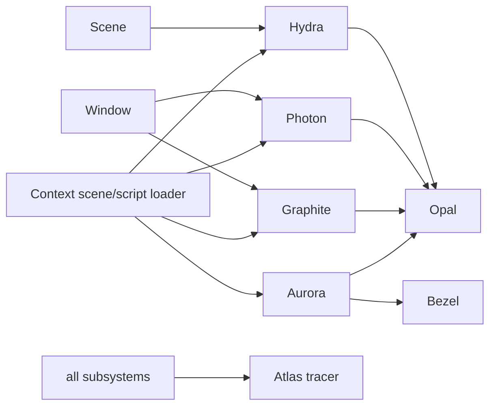

# Specialized systems

Atlas names its subsystem libraries separately because they have useful boundaries and could evolve independently.

## Graphite: runtime UI

Graphite implements engine-rendered UI, not the Qt editor. Its public surfaces are:

- layout containers and arrangement: `include/graphite/layout.h`, `graphite/layout.cpp`;
- style/theme values: `include/graphite/style.h`, `graphite/style.cpp`;
- text/font rendering: `include/graphite/text.h`, `graphite/text.cpp`;
- images: `include/graphite/image.h`, `graphite/image.cpp`;
- input widgets: `include/graphite/input.h`, `graphite/input/*.cpp`.

Graphite objects are `GameObject`/`UIObject`-compatible and enter `Window` through `addUIObject()` (`atlas/application/window.cpp:3645`). Script construction, style parsing, children, and callbacks are bridged in `runtime/lib/scripting.cpp:3124-3363,4518-5213,12847-13220`.

## Photon: global illumination and path tracing

Photon sits above Opal and is selected by `Window`:

- DDGI-style global illumination initialization/layout: `photon/gi.cpp:226,267`;
- path tracer initialization/output sizing/light buffers: `photon/path_tracing.cpp:154,186,489`;
- activation: `Window::enableGlobalIllumination()` at `atlas/graphics/deferred.cpp:255` and `Window::enablePathTracing()` at `atlas/application/window.cpp:5447`.

The path-traced mode bypasses raster object passes for the scene target in `Window::stepFrame()` (`atlas/application/window.cpp:1626-1644`) and resolves the tracer output into the active render target.

## Hydra: atmosphere, clouds, fluids

| Feature | Key functions |
|---|---|
| Atmosphere/time/weather | `Atmosphere::resetRuntimeState/update` at `hydra/atmosphere.cpp:76,95` |
| Sun/moon/light derivation | `hydra/atmosphere.cpp:223-309` |
| Cloud texture generation | `Clouds::getCloudTexture()` at `hydra/clouds.cpp:13` |
| 3D Worley noise | `hydra/worley.cpp:95-379` |
| Water/fluid surface | `Fluid::create/initialize/update` at `hydra/fluid.cpp:35,42,225` |
| Reflection/refraction captures | `Fluid::ensureTargets()` at `hydra/fluid.cpp:318`, `Window::updateFluidCaptures()` at `atlas/application/window.cpp:4754` |

`Scene::updateScene()` integrates atmosphere into skybox, ambient, and global lighting (`atlas/application/scene.cpp:16`).

## Aurora: terrain and procedural noise

Aurora provides Perlin, simplex, Worley, and fractal noise (`aurora/noise.cpp:17-206`) plus terrain generation/rendering (`aurora/terrain.cpp:27-374`) and biome definitions (`aurora/biome.cpp`, `include/aurora/terrain.h`). Terrain is a renderable game object, so it participates in the same `Window` queues and Opal pipeline as normal objects while using generated geometry.

## Tracing/debug data

Tracing code is split into logging and structured event categories:

- logger: `include/atlas/tracer/log.h`, `atlas/tracer/log.cpp`;
- graphics, memory, object, profiling, and resources: `atlas/tracer/data/*.cpp` with contracts in `include/atlas/tracer/data.h`;
- editor presentation/debugging: `editor/debug.cpp` and `include/editor/debug.h`.

`DebugTimer` instances in `Window::stepFrame()` (`atlas/application/window.cpp:1498-1499,1572`) divide CPU, main-loop, and GPU timing. Resource creation paths such as model mesh construction emit structured resource events (`atlas/object/model.cpp:433-445`).

## Network pipe

`include/atlas/network/pipe.h` and `atlas/network/pipe.cpp` contain the engine's pipe-based communication primitive. It is not part of the normal standalone frame flow shown elsewhere; treat it as an auxiliary transport rather than central runtime ownership.

## How these systems meet the core

